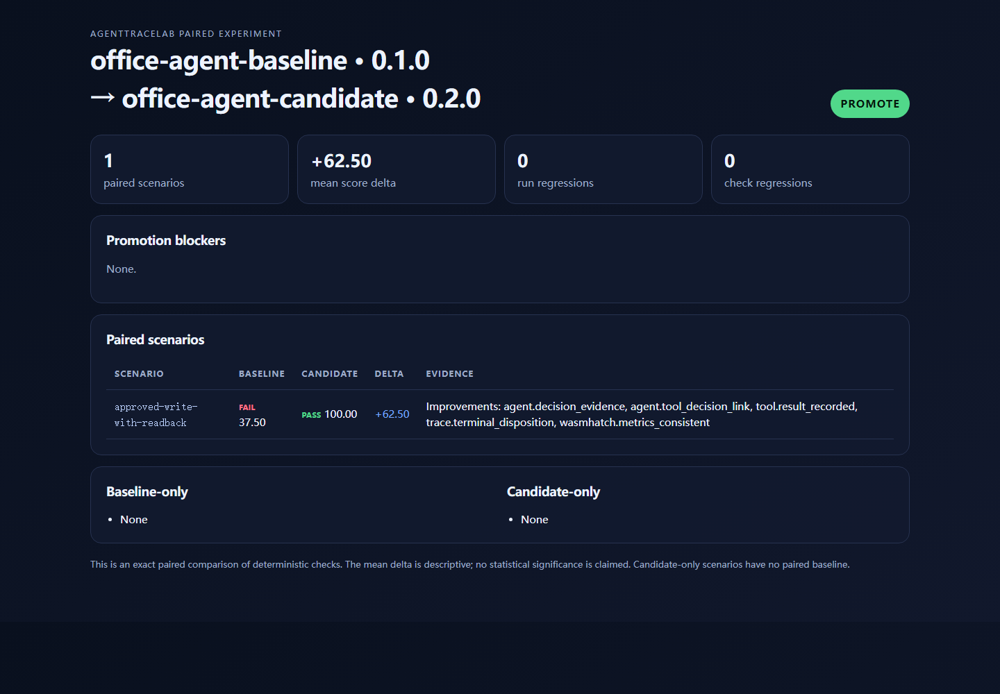

# AgentTraceLab

AgentTraceLab is an evidence-led evaluation backend for tool-using AI agents. It imports execution
traces, normalizes them into a framework-neutral model, runs deterministic safety and lifecycle
checks, and compares a candidate run with a baseline before promotion.



The first real integration is WasmHatch/OfficeAgent. AgentTraceLab consumes the existing
`wasmhatch.run-journal.v1` export, while its OpenTelemetry-compatible receiver accepts OTLP/HTTP
trace exports. WasmHatch does not need to be modified for this integration.

## Implemented in v1.1

- WasmHatch run-journal v1 importer with strict sequence validation.
- OpenInference-style OTLP importer with resource, scope, span, status, and attribute decoding.
- Native `POST /v1/traces` OTLP/HTTP receiver for JSON and Protobuf exports.
- Streaming wire-size enforcement, bounded gzip decompression, and media-type validation.
- Real OpenTelemetry Python SDK HTTP/Protobuf smoke path and end-to-end regression test.
- Separate OpenAI-compatible LLM-as-Judge reports with a versioned five-dimension trajectory rubric.
- Metadata-only default disclosure, explicit content opt-in, privacy fail-closed behavior, strict
  response validation, bounded retries, span-evidence verification, and persisted judge reports.
- Versioned human-labelled Judge calibration datasets with coverage, exact agreement, confusion
  matrices, Cohen's kappa, review rate, dimension MAE, pairwise agreement, and policy gates.
- Automatic human-review selection for deterministic/Judge conflicts, Judge deferrals, and low
  rubric scores, plus explicit audit sampling, immutable resolutions, and calibration export.
- Framework-neutral Trace / Span / DecisionEvidence models inspired by OpenInference terminology.
- Deterministic checks for:
  - contiguous trace order;
  - terminal disposition;
  - tool-result recording;
  - approval before committed effects;
  - validation after committed effects;
  - structured observation → action → validation → disposition evidence;
  - decision-to-tool linkage;
  - credential-shaped data leakage;
  - event budgets.
- Baseline/candidate regression comparison.
- FastAPI ingestion, retrieval, evaluation, and comparison endpoints.
- SQLite development storage and PostgreSQL Docker profile.
- CLI import, comparison, and versioned offline dataset commands.
- A versioned smoke dataset containing passing and intentional bad-case expectations.
- Bounded HTTP replay runner for WasmHatch, normalized, and OpenInference trace responses.
- Failure taxonomy for transport, trace contract, lifecycle, tool, authorization, validation,
  decision-evidence, privacy, and budget failures.
- WasmHatch export-batch evaluation with explicit synthetic/recorded/live evidence labels.
- Event-derived metric reconciliation and versioned promotion-policy gates.
- Scenario-paired baseline/candidate comparison with coverage-loss and check-regression detection.
- Standalone HTML experiment reports and JUnit XML regression artifacts for CI.

This release deliberately does **not** claim an OTLP exporter, OTLP/gRPC receiver, distributed
replay workers, authenticated multi-reviewer adjudication, or a production dashboard. Replay is
currently a bounded synchronous CLI runner; the OTLP/HTTP receiver stores and evaluates trace data.

WasmHatch itself is browser-only and deliberately exports journals through an explicit user
download. AgentTraceLab respects that boundary: batch evaluation consumes those exported files and
does not add a hidden upload or claim unattended WasmHatch replay.

## Architecture

```text
WasmHatch run-journal.v1 ──► WasmHatch adapter ──┐
                                                  ├──► normalized Trace/Span model
OTLP/HTTP + legacy OTLP JSON ──► OTLP adapter ────┘              │
                                                                 ├──► deterministic evaluator
versioned dataset manifest ──► offline runner ────────────────────┤
HTTP replay manifest ──► bounded target request ──► trace adapter ┤
                                                                 ├──► SQL trace/evaluation store
                                                                 ├──► deterministic + LLM Judge disagreement
                                                                 │           │
                                                                 │           └──► human review ──► new dataset version
                                                                 └──► baseline/candidate comparator
```

## Local development

```bash
uv sync --extra dev
uv run pytest
uv run uvicorn agenttracelab.api:app --reload
```

Open `http://127.0.0.1:8000/docs` for the generated API documentation.

Send standards-shaped OTLP/HTTP JSON traces to the native receiver:

```bash
curl -X POST http://127.0.0.1:8000/v1/traces \
  -H 'Content-Type: application/json' \
  --data-binary @tests/fixtures/openinference_otlp.json
```

Protobuf exporters use the same path with `Content-Type: application/x-protobuf`. See
[docs/otlp-http.md](docs/otlp-http.md) for compression, limits, responses, and current boundaries.

With the API running, send a real batched Protobuf export from the OpenTelemetry Python SDK:

```bash
uv run python examples/send_otel_trace.py
```

The command prints the generated trace ID. Retrieve it through `GET /v1/traces/{trace_id}` or inspect
its deterministic result through `GET /v1/evaluations/{trace_id}/latest`.

Import the included synthetic WasmHatch trace:

```bash
uv run agenttracelab import-wasmhatch tests/fixtures/wasmhatch_complete.json
```

The command exits with code `0` only when all required deterministic checks pass. A failed
evaluation exits with code `2`, making it usable as a CI regression gate.

Run the included repeatable smoke dataset:

```bash
uv run agenttracelab run-dataset evaluation/datasets/smoke/v1/manifest.json
```

The dataset runner distinguishes “the evaluator passed this trace” from “the observed result
matched the fixture's expectation.” This means intentional bad cases can pass the regression suite
without being misreported as successful Agent runs.

Run the HTTP replay contract against an Agent endpoint:

```bash
uv run agenttracelab run-replay evaluation/replays/example/v1/manifest.json \
  --output evaluation-results/office-agent.json
```

The checked-in endpoint is an example, not a running dependency. See
[docs/replay-contract.md](docs/replay-contract.md) before wiring a real target.

Evaluate an authorized set of exported WasmHatch journals and apply a release policy:

```bash
uv run agenttracelab evaluate-wasmhatch-batch path/to/manifest.json \
  --policy evaluation/policies/recorded-release.v1.json \
  --output evaluation-results/batch.json \
  --summary evaluation-results/summary.md
```

See [docs/wasmhatch-batch.md](docs/wasmhatch-batch.md) for the manifest and evidence-mode rules.

The checked-in synthetic smoke gate can be exercised without a running Agent:

```bash
uv run agenttracelab evaluate-wasmhatch-batch \
  evaluation/batches/smoke/v1/manifest.json \
  --policy evaluation/policies/synthetic-smoke.v1.json
```

Compare two batches without allowing aggregate scores to hide a scenario regression:

```bash
uv run agenttracelab compare-wasmhatch-batches \
  path/to/baseline/manifest.json path/to/candidate/manifest.json \
  --output evaluation-results/comparison.json \
  --summary evaluation-results/comparison.md \
  --html evaluation-results/comparison.html \
  --junit evaluation-results/comparison.junit.xml
```

See [docs/batch-comparison.md](docs/batch-comparison.md) for the paired-denominator rules and
[docs/comparison-artifacts.md](docs/comparison-artifacts.md) for the generated artifacts.

Reproduce the report shown above from the checked-in synthetic baseline and candidate:

```bash
uv run agenttracelab compare-wasmhatch-batches \
  evaluation/datasets/smoke/v1/baseline-batch.json \
  evaluation/datasets/smoke/v1/candidate-batch.json \
  --output evaluation-results/promotion-demo.json \
  --summary evaluation-results/promotion-demo.md \
  --html evaluation-results/promotion-demo.html \
  --junit evaluation-results/promotion-demo.junit.xml
```

The image is demonstration evidence from synthetic fixtures, not a production benchmark.

Run an optional qualitative judge against a stored trace without changing its deterministic gate:

```bash
uv run agenttracelab judge-trace TRACE_ID \
  --base-url https://api.deepseek.com \
  --model deepseek-flash \
  --output evaluation-results/judge.json
```

The API key is read from `AGENTTRACELAB_JUDGE_API_KEY`. Content is omitted by default. See
[docs/llm-judge.md](docs/llm-judge.md) before enabling `--include-content`.

Evaluate Judge/Prompt configurations against human labels without making network calls:

```bash
uv run agenttracelab analyze-judge-calibration \
  evaluation/judge-calibration/smoke/v1/manifest.json \
  --output evaluation-results/judge-calibration.json \
  --summary evaluation-results/judge-calibration.md
```

The smoke dataset deliberately fails one weak judge to prove the gate catches missing coverage and
poor agreement. See [docs/judge-calibration.md](docs/judge-calibration.md).

Inspect, resolve, and promote automatically selected disagreements into a new labelled dataset:

```bash
uv run agenttracelab list-reviews --state pending
uv run agenttracelab resolve-review REVIEW_ID path/to/resolution.json
uv run agenttracelab export-review-calibration production-disagreements v1 \
  evaluation/judge-calibration/production-disagreements/v1/manifest.json
```

The exporter refuses to overwrite an existing file, so corrected labels require a new dataset
version. See [docs/human-review.md](docs/human-review.md) for selection, priority, payload, and
security boundaries.

## HTTP API

- `POST /v1/traces` (native OTLP/HTTP JSON or Protobuf receiver)
- `POST /v1/traces/import/wasmhatch`
- `POST /v1/traces/import/otlp` (legacy JSON convenience endpoint)
- `POST /v1/traces/import/normalized`
- `GET /v1/traces/{trace_id}`
- `GET /v1/evaluations/{trace_id}/latest`
- `GET /v1/judgments/{trace_id}/latest`
- `POST /v1/reviews/queue/{trace_id}` (forced audit sampling or idempotent re-check)
- `GET /v1/reviews?state=pending|resolved`
- `GET /v1/reviews/{review_id}`
- `POST /v1/reviews/{review_id}/resolve`
- `POST /v1/comparisons`
- `GET /health`

## Evidence policy

AgentTraceLab distinguishes trace presence from Agent correctness. A model/tool log alone does not
prove an Agent loop. Passing `agent.decision_evidence` requires structured evidence that connects an
observation to a selected action, optional tool call, result validation, and a continue/replan/stop
disposition.

Deterministic checks and LLM-judge checks remain separate in reports. Scores from different modes
must never be merged into one unexplained percentage.

## Roadmap

1. OTLP exporter, OTLP/gRPC receiver, and broader semantic-convention coverage.
2. Async/distributed replay workers with explicit provider/model configuration.
3. Authenticated reviewer assignment, multi-annotator adjudication, and uncertainty-based sampling.
4. Multi-experiment dashboard built on the current standalone comparison report.
5. GitHub check annotations and policy support beyond WasmHatch batch reports.

See [docs/references.md](docs/references.md) for the open-source projects studied and the reuse
boundary.
